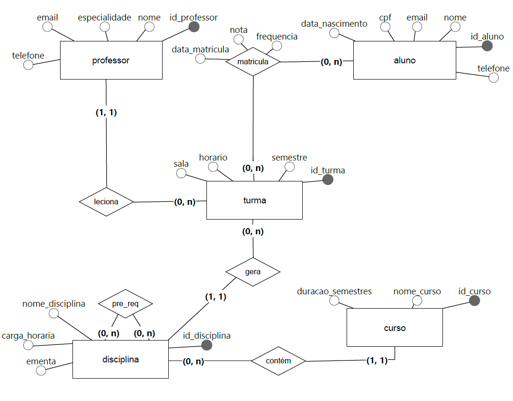
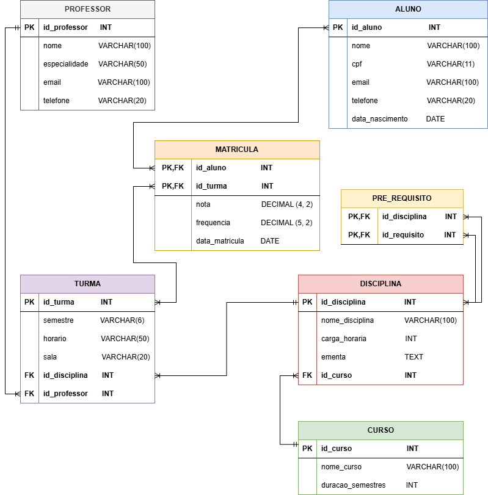

# Sistema de Gestão Acadêmica (SGA-DEV) - Database

Este repositório contém a implementação física do banco de dados para o projeto **SGA-DEV**, desenvolvido como parte da disciplina de Modelagem de Banco de Dados.

O projeto consiste na modelagem completa (Conceitual, Lógica e Física) e na implementação SQL de um sistema para gerenciar o ciclo de vida acadêmico de uma instituição de ensino superior, controlando alunos, professores, cursos, disciplinas, turmas e matrículas.

---

## 🛠️ Tecnologias Utilizadas

* **Linguagem:** SQL (Compatível com PostgreSQL e MySQL)
* **Modelagem:** BrModelo (Conceitual) e DB Designer (Lógico)
* **Ferramentas:** VS Code, Git & GitHub, Extensions (SQLTools)

---

## 📐 Modelagem do Banco de Dados

Para garantir a integridade e a organização dos dados, o projeto passou por fases rigorosas de modelagem antes da implementação.

### 1. Modelo Conceitual (DER)
Diagrama Entidade-Relacionamento destacando as entidades e seus relacionamentos (1:N, N:M).



### 2. Modelo Lógico (Relacional)
Estrutura normalizada (3FN) com definição de Tipos de Dados, Chaves Primárias (PK) e Chaves Estrangeiras (FK).



---

## 📂 Estrutura do Projeto

Os scripts SQL foram organizados sequencialmente para facilitar a execução e manutenção:

| Arquivo | Descrição |
| :--- | :--- |
| `01_create_tables.sql` | **DDL:** Script de criação de todas as tabelas, relacionamentos e restrições de integridade (PKs e FKs). |
| `02_insert_data.sql` | **DML:** Script para povoar o banco com dados fictícios de cursos, professores, alunos e turmas para testes. |
| `03_queries.sql` | **DQL:** Contém consultas complexas utilizando `JOINs`, `GROUP BY`, `ORDER BY` e filtros `WHERE` para gerar relatórios. |
| `04_update_delete.sql` | **DML:** Exemplos práticos de manipulação de dados, incluindo atualização de registros e remoção segura de dados. |

---

## 🚀 Como Executar

Para rodar este projeto em sua máquina ou ferramenta de banco de dados (como PGAdmin, DBeaver ou MySQL Workbench):

1.  **Clone este repositório:**
    ```bash
    git clone [https://github.com/danfelixx11/sga-dev-database.git](https://github.com/danfelixx11/sga-dev-database.git)
    ```

2.  **Abra sua ferramenta de Banco de Dados** e conecte-se ao seu servidor local.

3.  **Execute os scripts na ordem numérica:**
    * Primeiro o `01_create_tables.sql` para criar a estrutura.
    * Depois o `02_insert_data.sql` para inserir os dados.
    * Em seguida, execute o `03_queries.sql` para ver os relatórios.
    * Por fim, teste as alterações com o `04_update_delete.sql`.

---

## 👨‍💻 Autor

Desenvolvido por **Daniel Félix**.

* **LinkedIn:** [linkedin.com/in/danfelix-dev](https://www.linkedin.com/in/danfelix-dev/)
* **GitHub:** [github.com/danfelixx11](https://github.com/danfelixx11)